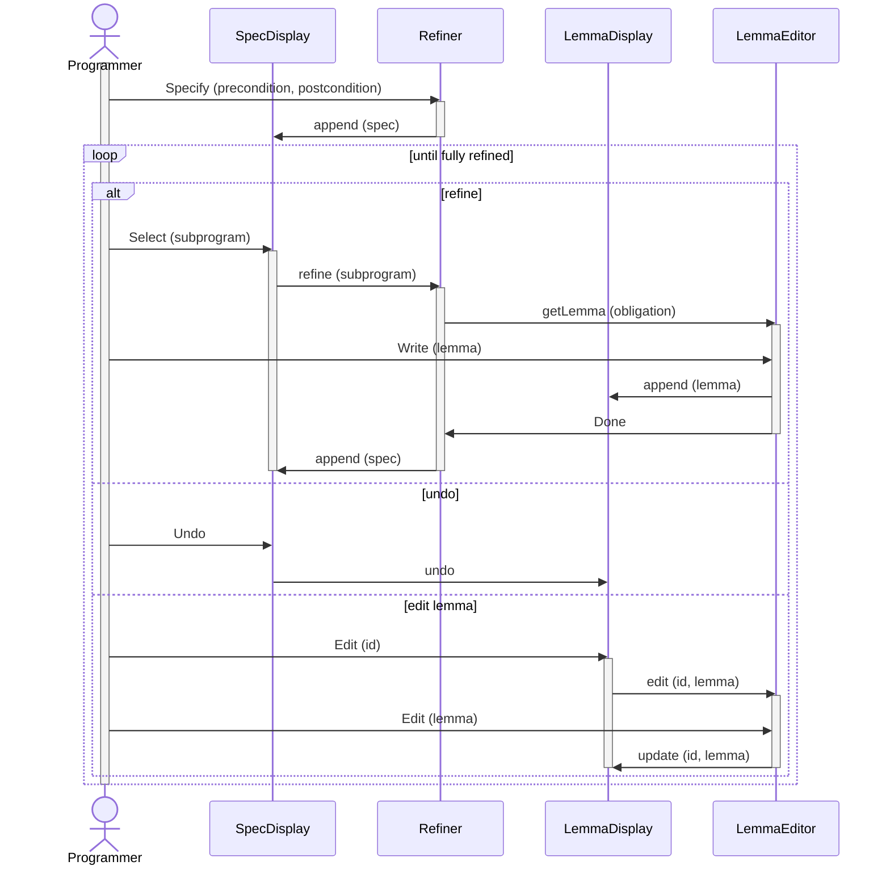

# GCL Playground
A development environment for constructing programs calculationally using Dijkstra's techniques.

### Architecture

GCL Playground is composed of four primary entities which communicate via messages, illustrated below.

